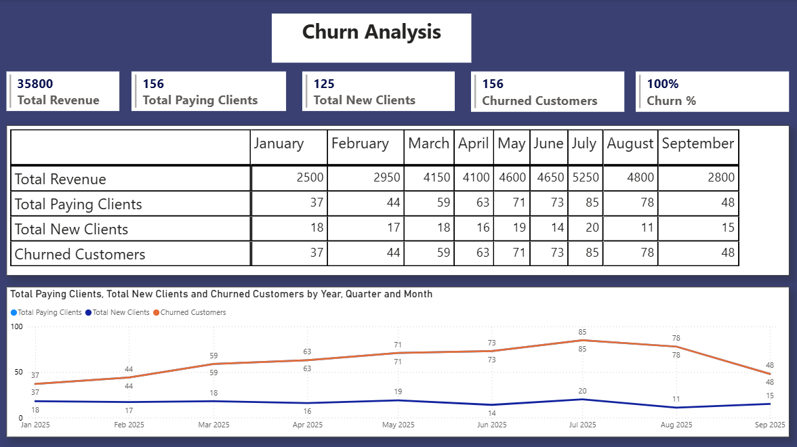
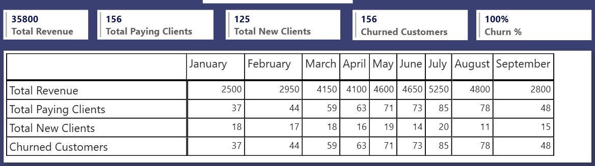
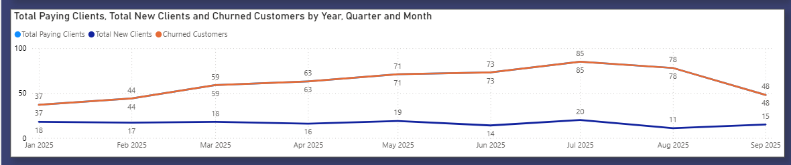

# Churn Analysis Using Power BI on Stripe Dataset

A Power BI dashboard that analyzes customer churn, payment behavior, and transaction trends using real Stripe payment data.

---

## 📊 Dashboard Preview


*Payment status breakdown and churn rate overview*


*Decline reason breakdown and revenue at risk*


*Monthly transaction volume and failure trends*

> 📸 To add your own: take screenshots of each report page in Power BI Desktop → save them to `assets/screenshots/` → they will automatically appear here.

---

## 📁 Project Overview

This project explores customer retention and churn patterns by analyzing Stripe transaction data through an interactive Power BI report. It identifies failed payments, refund rates, and behavioral signals that indicate churn risk — helping businesses make data-driven decisions to improve revenue recovery.

---

## 🗂️ Repository Structure

```
stripe-churn-analysis-powerbi/
├── assets/
│   └── screenshots/          # Dashboard preview images (add yours here)
│       ├── overview.png
│       ├── decline_analysis.png
│       └── customer_trends.png
├── Master_Stripe_Data.csv    # Raw Stripe export (846 transactions)
├── Churn_Analysis_Using_Power_BI_On_Stripe_Dataset.pbix   # Power BI report
└── README.md
```

---

## 🗂️ Dataset

**File:** `Master_Stripe_Data.csv`

| Property | Details |
|---|---|
| Records | 846 transactions |
| Time Period | February 2025 – August 2025 |
| Currency | USD |
| Source | Stripe Payments Export |

### Key Columns

| Column | Description |
|---|---|
| `Created date (UTC)` | Timestamp of the transaction |
| `Amount` | Charge amount (in cents) |
| `Status` | Payment outcome — Paid, Failed, Refunded, Pending, Canceled |
| `Decline Reason` | Reason for failed charges |
| `Fee` | Stripe processing fee |
| `Customer Email` | Customer identifier |
| `Description` | Transaction description |
| `booking_id`, `user_id`, `listing id` | Business-specific metadata |
| `trip start`, `trip end` | Trip/booking date range metadata |
| `source`, `type`, `rechargeType` | Payment source and type metadata |

### Transaction Status Breakdown

| Status | Count |
|---|---|
| Paid | 573 |
| Failed | 226 |
| requires_payment_method | 20 |
| Refunded | 17 |
| Canceled | 8 |
| Pending | 2 |

> The ~26.7% failure rate is a key focus of the churn analysis.

---

## 📈 Power BI Report

**File:** `Churn_Analysis_Using_Power_BI_On_Stripe_Dataset.pbix`

### What the Dashboard Covers

- **Churn Rate Overview** — % of customers with failed or declined transactions over time
- **Payment Status Distribution** — Breakdown of Paid vs. Failed vs. Refunded transactions
- **Decline Reason Analysis** — Most common failure reasons and their frequency
- **Revenue at Risk** — Amount lost to failed and refunded payments
- **Customer-Level Trends** — Repeat failures per customer email
- **Time Series Analysis** — Monthly transaction volume and failure trends (Feb–Aug 2025)

---

## 🚀 Getting Started

### Prerequisites

- [Power BI Desktop](https://powerbi.microsoft.com/desktop/) (free download)

### Steps

1. Clone this repository:
   ```bash
   git clone https://github.com/your-username/stripe-churn-analysis-powerbi.git
   cd stripe-churn-analysis-powerbi
   ```

2. Open the report in Power BI Desktop:
   - Launch **Power BI Desktop**
   - Go to **File → Open** and select `Churn_Analysis_Using_Power_BI_On_Stripe_Dataset.pbix`

3. If prompted to refresh data, point the source to `Master_Stripe_Data.csv` in the repo folder:
   - Go to **Home → Transform Data → Data Source Settings**
   - Update the file path to match your local directory

---

## 🔍 Key Insights

- Over **1 in 4 transactions failed**, representing significant revenue leakage
- The majority of failures are concentrated in specific decline reason categories, making targeted recovery possible
- Refund and cancellation rates are relatively low (~3%), suggesting most churn happens at the payment attempt stage rather than post-payment

---

## 🛠️ Tools Used

- **Power BI Desktop** — Data modeling and visualization
- **Stripe** — Payment data source
- **CSV** — Data preparation and cleaning


## 🙋 Author

**Your Name**
 [GitHub]()
